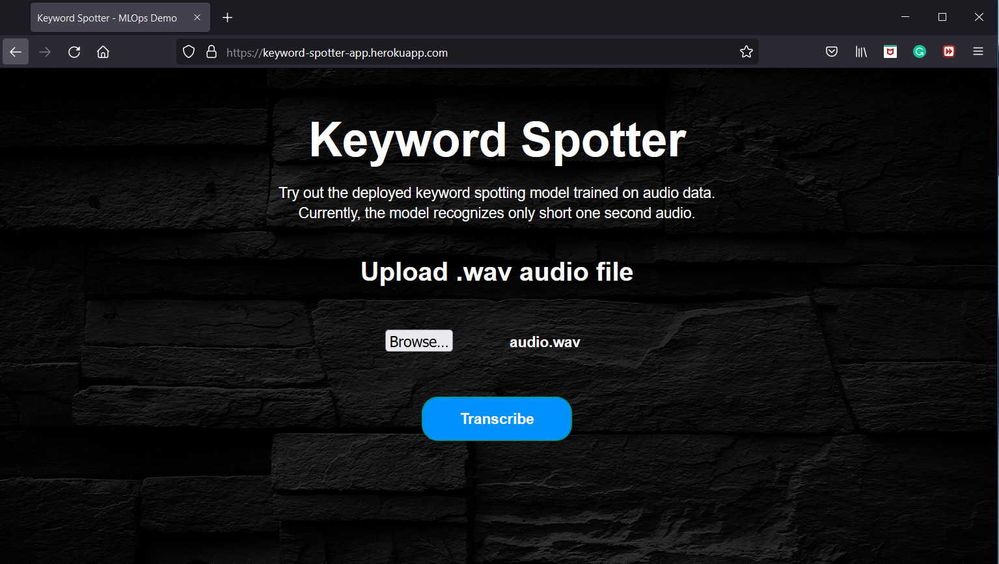
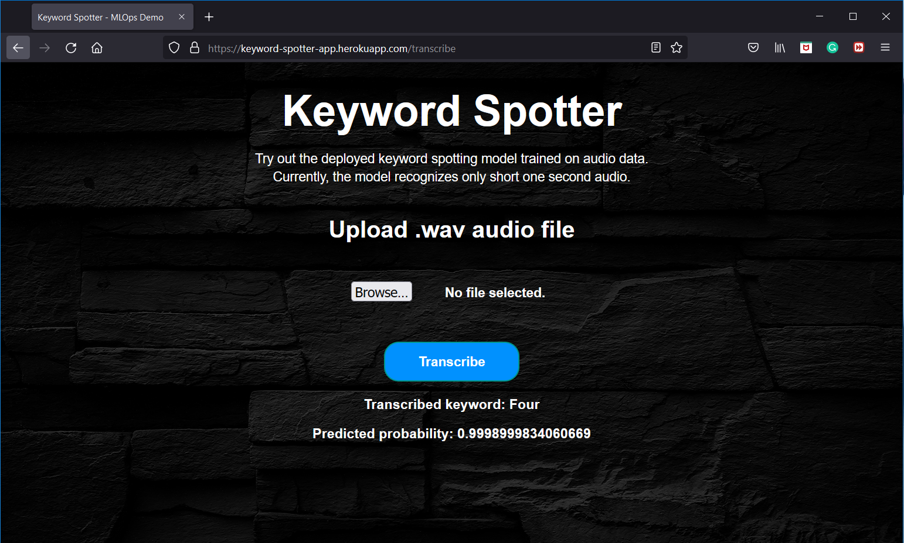
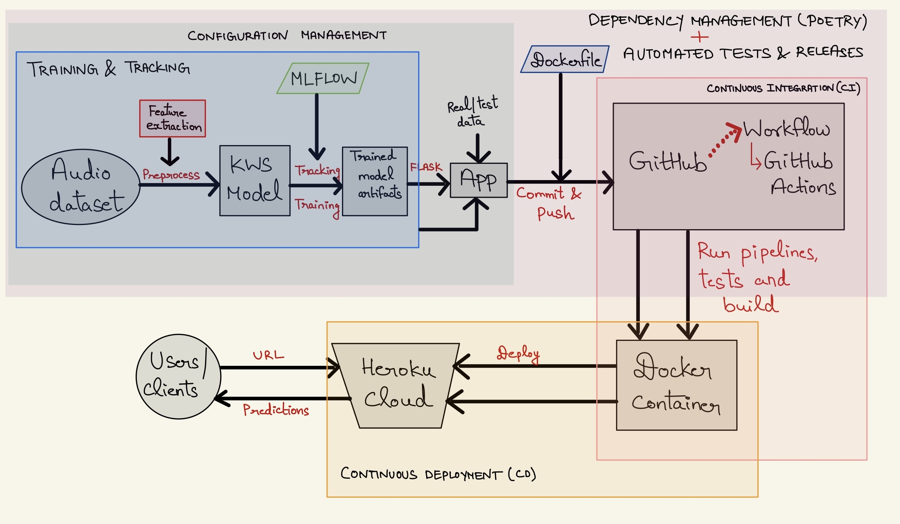
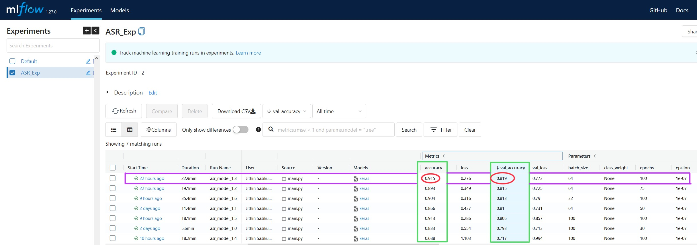

# Deploying an end-to-end keyword spotting model into cloud server using Flask and Docker with CI/CD pipeline


This project promulgates a `pipeline` that `trains` an end-to-end keyword spotting model using input audio files, `tracks` experiments by logging the model artifacts, parameters and metrics, `build` them as a web application followed by `dockerizing` them into a container and deploys the application containing trained model artifacts as a docker container into the cloud server with `CI/CD` integration, automated tests and releases.

## Author

- [@Jithin Sasikumar](https://www.github.com/Jithsaavvy)

## Languages and Tools

<div align="">
<a href="https://www.python.org" target="_blank" rel="noreferrer"></a>
<a href="https://www.tensorflow.org" target="_blank" rel="noreferrer"></a>
<a href="https://www.docker.com/" target="_blank" rel="noreferrer"></a>
<a href="https://flask.palletsprojects.com/en/2.2.x/" target="_blank" rel="noreferrer"> </a>
<a href="https://github.com/features/actions" target="_blank" rel="noreferrer"> </a>
<a href="https://python-poetry.org/" target="_blank" rel="noreferrer"> </a> 
<a href="https://hydra.cc/docs/intro/" target="_blank" rel="noreferrer"> </a>
<a href="https://www.mlflow.org/docs/latest/python_api/mlflow.html" target="_blank" rel="noreferrer"> </a>
<a href="https://www.heroku.com/platform" target="_blank" rel="noreferrer"></a> 
<a href="https://docs.pytest.org/en/7.1.x/" target="_blank" rel="noreferrer"></a> 
</div>
 
<br>

## Keyword Spotter in Heroku - Demo

_**Link**: Will be updated. Please check the `Disclaimer` below the screenshot for more !!!_

|  |
|:--:|
| <b>Figure 1a: App demo - Audio input to app for predicting keyword from trained model artifact</b>|

|  |
|:--:|
| <b>Figure 1b: App demo - Predicted keyword with probability</b>|

_**Disclaimer:**_ <br>
_1. This app is just a demo and not for realtime usage. The main objective is to get ML models into production in terms of deployment and CI/CD, from MLOps paradigm_. <br>
_2. Additionally, due to some technical issues in the Heroku backend, the app currently crashes, so the Heroku app link is not provided as of now. It will be updated once the issues are solved and when the app is up and running_.

## Directory structure

```
├── .github
│    └── workflows
│        ├── deploy.yaml
│        ├── release.yaml
│        └── tests.yaml
├── app.py
├── artifacts
│   └── 2
│       └── asr_model_1.3
│           ├── meta.yaml
│           ├── metrics
│           ├── model_artifacts
│           │   ├── model
│           │   │   ├── conda.yaml
│           │   │   ├── data
│           │   │   │   ├── keras_module.txt
│           │   │   │   ├── model
│           │   │   │   │   ├── keras_metadata.pb
│           │   │   │   │   ├── saved_model.pb
│           │   │   │   │   └── variables
│           │   │   │   └── save_format.txt
│           │   │   ├── MLmodel
│           │   │   ├── python_env.yaml
│           │   │   └── requirements.txt
│           │   └── model_summary.txt
│           ├── params
│           └── tags
├── config_dir
│   ├── configType.py
│   ├── config.yaml
├── dataset
│   ├── test
│   └── train
├── Dockerfile
├── images
├── poetry.lock
├── pyproject.toml
├── README.md
├── src
│   ├── data.py
│   ├── exception_handler.py
│   ├── experiment_tracking.py
│   ├── inference.py
│   ├── __init__.py
│   ├── main.py
│   ├── model.py
│   └── train.py
├── static
│   ├── bg.jpg
│   └── page.css
├── templates
│   └── page.html
└── tests
    ├── __init__.py
    └── test_kws_spotter.py
```

## Motivation

`Deep learning/Machine learning` or `AI` (in short) is the current hot topic which has its application in most of the fields and it's demand is increasing day-by-day. But at this point, the sad truth is - `Only very less percentage of ML/DL models makes into production`. That's when `MLOps` comes into the picture. 

The major challenges with ML during development are:
  - Development, training and deployment environment can be different leading to dependency hassles.
  - Whenever input data changes, its becomes more tedious to reproduce the experiment.
  - Experiment tracking and analyzing can mostly be difficult and challenging.
  - Core ML code turn out to be spaghetti jungle which introduces lot of `boilerplate` codes.

MLOps is a budding field that productionalize ML models. `ML/DL` being a core research field, still misses out the `deployment` paradigm which includes design principles, patterns, testing, code styles etc. This restricts the domain to be used in the production environment efficiently. To nullify this, MLOps integrates DevOps principles into ML domain and serves as an intersection point of `Machine learning`, `Datascience` and `DevOps`.

## Description

The project is a concoction of `research` (audio signal processing, keyword spotting, ASR), `development` (audio data processing, deep neural network training, evaluation) and `deployment` (building model artifacts, web app development, docker, cloud PaaS) by integrating `CI/CD` pipelines with automated releases and tests.

|  |
|:--:|
| <b>Figure 2: Project Workflow - Deployment with CI/CD</b>|

## Technical facets

1. Managing dependencies and packaging using `Poetry` across the application.
2. Handling and maintaining configurations across the application using `Hydra`.
2. Training a deep end-to-end `CNN-LSTM` neural network on `Google Speech command dataset` using `Tensorflow` to detect keywords or short one-second utterances.
3. Tracking the entire model training using `MLflow` from which  `trained model artifacts`, metrics and parameters are logged.
4. Building a web app using `Flask API` that provides an intuitive interface to make predictions from the trained model using real audio data.
5. Writing test cases to perform unit tests using `Pytest`.
6. Writing a `docker` file and pushing it along with other application files including source code, artifacts etc. to the `GitHub` repository.
7. Automating `CI/CD Pipeline` as follows:
    - Initialize `GitHub Actions` workflows for CI. This will automatically trigger the pipeline whenever it tracks a new commit to the repository.
    - Automated tests are perfomed using `Pytest` after every commit to the `main` branch.
    - Run the pipeline which builds the entire application along with the model to the docker image and then containerize into a `docker container`.
    - A new release will be created automatically when tags are pushed to the repository using `release.yaml`
    - Deploy the docker container into `Heroku cloud server` that hosts the particular application. 
    - The user can access the app via `URL`. The app facilitates to upload an input short `audio .wav file`, in which the predicted keyword is returned from the model along with the probability and displayed as a result in the app UI/webpage.

8. The above points are only a technical gist of the entire application. More detailed explanation about each facet is described in the [pipeline section](#pipeline) below.

## Pipeline

[Keyword Spotting](https://arxiv.org/ftp/arxiv/papers/1703/1703.05390.pdf) (KWS) is the task of detecting a particular keyword from speech. Current voice-based devices such as **Amazon Alexa**, **Google Home** etc. first detect the predefined keywords (wakewords) from the speech locally on the device. When such keywords are detected, a full scale automatic speech recognizer is triggered on the cloud for further recognition of entire speech and processing. Traditional approaches for KWS are based on Hidden
Markov Models with sequence search algorithms. The advancements in deep learning and increased data availability replaced them with deep learning based approaches as state-of-the-art.

### Dependency Management - Poetry

[Poetry](https://python-poetry.org/docs/) is a tool for dependency management and packaging in Python. It facilitates to declare the libraries in which the project is dependent on and  manages (install/update) them efficiently without much hassles. In short, it is an all-in-one tool to manage Python packages. It allows to seperate the global dependencies and dev-dependencies without cluttering.

[pyproject.toml](./pyproject.toml) holds all the information necessary to manage the packages. All the global dependencies are defined in `[tool.poetry.dependencies]` and dev-dependencies like **pytest, flake8** in `[tool.poetry.dev-dependencies]` which makes it easier to be used for development and production. [poetry.lock](./poetry.lock) facilitates to use the exact same versions of the dependencies.

#### Pro-Tip to install dependencies using poetry

**When the project needs multiple packages,**
  1. One way is, to install ony by one manually using:
  ```
  poetry add
  ```   
  2. But, it is very tedious and manual process to do that way. So, to install multiple dependencies from `requirements.txt` (conventional way), use the following command:
  ```
  $cat requirements.txt | xargs poetry add

  ```
**_Note:_**  
_In the repo, `requirements.txt` is not added. If needed, please define all your packages in it and run the command above. Finally, poetry will install all your packages from requirements file._

### Configuration Management

Every application or project comprises of multiple configuration settings. The most easy and obvious way is, defining all configurations in `config.py` or `config.json` file. But, it is always important to keep `scalability` and `reusability` in mind when writing code or developing an application. A good practice to do so, is using `configuration managers` to serve this purpose. One such config manager used in this project is [Hydra](https://hydra.cc/docs/intro/). `Hydra` is an open-source python framework that facilitates in creating a hierarchical configuration dynamically by means of composition and overriding them through config files and storing them. In this project, [config_dir](./config_dir/) holds all the project configurations and they are defined in [config.yaml](./config_dir/config.yaml). Please feel free to make necessary changes to the paths and parameters, based on the requirement.

### Audio Data (speech signals) processing & Feature extraction
[Signal processing](https://arxiv.org/ftp/arxiv/papers/1305/1305.1925.pdf) is the process of transforming and extracting relevant information from the speech signal in an efficient way. Here, every audio will be represented as vectors constituting the amplitude of the sound wave in intervals of $1/16000$ of a second. [Google Speech command dataset](https://www.kaggle.com/competitions/tensorflow-speech-recognition-challenge/data) via kaggle is used for this project. It consists of $65,000$ one-second long utterances. In our case, the model will be trained on $25$ keywords or short words.

Firstly, the audio has to be embedded into the vector space which constitutes the features to learn. To facilitate that, [Mel-Frequency Cepstral Coefficients](https://en.wikipedia.org/wiki/Mel-frequency_cepstrum) (MFCC) is the most common widely used, feature extraction technique for audio data. MFCCs are derived using `Fourier transform` and `log-Mel spectrogram`. More detailed mathematical explanation  can be found [here](https://en.wikipedia.org/wiki/Mel-frequency_cepstrum). In order to extract these features, `librosa` is used. [data.py](./src/data.py) contains the code for preprocessing audio and extracting features from them. It reads the audio file, compute MFCC and pad them for fixed-sized vector for all audio files as CNN cannot handle sequential data. In order to avoid any hassles in  loading and processing plethora of audio files, it's a good practice to dump them to `.npy` arrays, which makes it easier for further usage.

_**Note:** Due to large file size, the training data (.npy) files are uploaded to shared folder. Download it from [here](https://www.dropbox.com/sh/4wjo8e8h4cg4xlo/AAAC3yR_kj5oq-ZcJopBosYYa?dl=0) and make sure that, the downloaded files are placed in [this directory](./dataset/train/). [Test directory](./dataset/test/) contains some sample audio files for local inferencing._

### CNN-LSTM Model

The end-to-end model used in this project is deeply inspired from [Deep Speech 2.0](https://arxiv.org/pdf/1512.02595.pdf). `Deep speech 2.0` is proposed for end-to-end ASR tasks which consists of set of `1D or 2D convolutional layers` followed by set of `recurrent` or `GRU` layers and set of `fully connected layers`. The main advantage is, it uses `batch normalization` even in the `recurrent` layers. It uses `CTC loss` function to predict the most probable output label yielding very good performance.

The similar kind of model is developed for this work with some changes. It is an end-to-end model that accepts audio MFCC features as input and outputs label probabilities to recognize keywords. The usage of CTC loss function is feasible, only if the model size is very large in order to learn from a large dataset. Since this is a `KWS task` and considering the model and dataset size **(small actually)**, the CTC loss function is replaced with `categorical cross-entropy` as it predicts the most probable keywords instead of entire long utterance.

`CNN-LSTM` model referenced from [this paper](https://arxiv.org/ftp/arxiv/papers/1703/1703.05390.pdf) has three `1D convolutional layers` with `maxpooling` and `batchnorm` layers for each. The outputs of the convolutional layer is fed to `LSTM layers` (2 in total) which processes the entire frame. These LSTM layers has batchnorm layer too. Outputs of the LSTM layers are fed to the `fully connected dense layer` with `softmax layer` at the end. `ReLu` is the activation function for all layers. `Dropout` layers are added throughout the network for `regularization`. The model summary can be viewed from [here](./artifacts/2/asr_model_1.3/model_artifacts/model_summary.txt). [model.py](./src/model.py) defines the CNN-LSTM model with `Tensorflow` and `Keras`. The model training is defined in [train.py](./src/train.py).

 _**Note:** This project is not core research-centric. So the model with validation accuracy of 82% used, may not be the best optimized one achieving state-of-the-art performance as hyperparameter tuning is not performed. They are out of the scope of this project, as the main objective is to develop an end-to-end pipeline from data preparation till deployment via CI/CD pipelines `(MLOps paradigm)`._

### MLflow - Model tracking

[MLflow](https://mlflow.org/) is an open source platform for managing end-to-end machine learning lifecycle. It provides functionality to track, log, register and deploy models. But in this project, MLflow is only used for experiment tracking and logging model artifacts with metrics and parameters. The artifacts can be found in [artifacts directory](./artifacts/). The **directory tree** is:

```
─── artifacts 
        └─── 2
             └─── asr_model_1.3
                    ├─── metrics
                    ├─── model_artifacts
                    │   └─── model
                    │       └─── data
                    │           └─── model
                    │               ├─── assets
                    │               └─── variables
                    ├─── params
                    └─── tags
```
[experiment_tracking.py](./src/experiment_tracking.py) provides the definition of `MLFlowTracker` user-defined dataclass which handles the entire MLflow tracking responsibility. It is implemented with the interface `ExperimentTracker(Protocol)` with the flexibility to be used for any logging. The tracking, logging of model artifacts, parameters etc. are done by `MLFlowTracker` class. MLflow library provides an UI - `mlflow ui` through which all model experiments (runs) can be viewed. The model selection process is done by:


|  |
|:--:|
| <b>Figure 3: Model selection via MLflow UI</b>|

The aforementioned, same functionality is also implemented in the code as well. The function to select best model based on the resulting metric is implemented in `find_best_model()` method of [MLFlowTracker](./src/experiment_tracking.py).

### Pytest

[Pytest](https://docs.pytest.org/en/7.1.x/) framework makes it easy to write small, readable tests, and can scale to support complex functional testing for applications and libraries. [tests](./tests/) directory contains all the test cases defined. Currently, test cases are written only for some scenarios but more tests can also be added. For the automation part, please refer to [GitHub Actions](#github-actions).

### FLASK API

[Flask](https://flask.palletsprojects.com/en/1.1.x/) is a micro web framework for creating APIs in Python. It is a simple yet powerful web framework with the ability to scale up to complex applications. 

[app.py](./app.py) creates a web application that wraps the trained model to be used for `inferencing` using `real audio data` by means of `FLASK`. It facilitates the application to run from a server which defines every routes and functions to perform. Instead of predicting from a script, it'll be more intuitive to predict from a `GUI`. The front-end is designed using `HTML` scripts from the [templates directory](./templates/) and the page styles are defined in `CSS` in [static directory](./static/). Flask deploys the application in the `localhost` by default, but let's deploy in the cloud server.

### CI/CD Pipeline

[Continuous Integration and Continuous Deployment (CI/CD)](https://neptune.ai/blog/ways-ml-teams-use-ci-cd-in-production) are the core practices in `MLOps` that are embraced from `DevOps`. CI is the process of automating the building and testing of code every time it is committed with version control (Git) and pushed to the same repository. CD is the process of automating the deployment of the application to the production environment. The tools and components used in this project for CI/CD are described below: 

### Docker

Now, the model artifacts are ready and are built into an web API, it's the time for deployment to host this application. To facilitate them a step further, `docker` would be a great tool.  [Docker](https://www.docker.com/) eases the developers to package applications or software which can be easily reproduced on another machine. It uses containers to pack any applications with its dependencies to deploy in another environment. Generally, it is not a mandatory tool or step for deployment as it can also be done without dockers but they serve many purpose like portability, scalability, version control, no dependency hassles etc. Thus, docker is a great tool in the deployment cycle.

The main idea of using docker in this project is, to package and build a `docker image` from the FLASK application with necessary files and containerize them into a `docker container` which can be deployed in any server (in this case - Heroku cloud server). [Dockerfile](./Dockerfile) contains all the commands needed to build an image. The command to install external packages for any `Debian or Ubuntu` based systems are also added. The `docker` serves as a bridge in the `CI/CD` pipeline between the web app and cloud server.

### GitHub Actions

[GitHub Actions](https://docs.github.com/en/actions/learn-github-actions/understanding-github-actions) is a CI/CD platform which facilitates in automating the build, test, and deployment pipeline. Workflows can be created for building and testing every commit or pull request to the Git repository, or deploy merged pull requests to production. In our case, whenever the repository tracks a new commit, it triggers the CI/CD workflow pipeline. 

`./github/workflows` defines the workflows that are needed to run the pipeline whenever triggered by an event. **Three** workflows are defined and used as follows:
  - `deploy.yaml` for building, testing and deploying the application to the cloud. 
  - `release.yaml` automatically creates a **GitHub release** whenever a tag is committed with version number and relevant release details. All the releases can be accessed from [here](https://github.com/Jithsaavvy/Deploying-an-end-to-end-keyword-spotting-model-into-cloud-server-by-integrating-CI-CD-pipeline/releases).
  - `tests.yaml` automates all test cases defined in [tests](./tests/) during every commit.

### Heroku Cloud PaaS

[Heroku](https://www.heroku.com/) is a container-based cloud Platform as a Service (PaaS) to deploy, manage, and scale modern apps. It accounts for the CD pipeline. As a result of CI, when docker container is build, CD deploys it into `Heroku` cloud which hosts the application and can be accessed via `URL`. _In layman terms, the application is on the internet, up and running and can be accessed with website or URL_. The command for Heroku is included in the [Dockerfile](./Dockerfile) itself.

As a result, the application will be deployed and the snapshot of application UI is depicted in the [Demo](#KeywordSpotterinHeroku-Demo) section.

## Run locally

Clone the project

```bash
  git clone <repository_url>
```

Navigate to the project directory

```bash
  cd <cloned_repository_name>
```
Install `poetry`. It also works with `conda envs`

```bash
  pip install poetry
```

Install all dependencies using poetry

```bash
  poetry install
```

Download `.npy` dataset from [here](https://www.dropbox.com/sh/4wjo8e8h4cg4xlo/AAAC3yR_kj5oq-ZcJopBosYYa?dl=0). Make sure to put them in [./dataset/train/](./dataset/train/) directory. If not, it is fine to use a different directory but, make sure to specify the valid directory name or path in the [config.yaml](./config_dir/config.yaml) file.

Train the model

```bash
  poetry run python src/main.py
```

The above script trains the model and logs the model artifacts in [artifacts](./artifacts/) directory. 

To run inference locally,

```bash
  poetry run python src/inference.py
```

To run tests locally,

```bash
  poetry run pytest
```

Use audio files from this [test directory](./dataset/test/) for local inferencing or download the full test-set from [here](https://www.kaggle.com/competitions/tensorflow-speech-recognition-challenge/data).

_**Note:** Assign necessary parameter variables and path in the [config.yaml](./config_dir/config.yaml). If it throws any error, please ensure that valid `PATH_NAMES` and `parameter` values are used._ 

Additionally, to run locally via docker container , build image from [Dockerfile](./Dockerfile) and  run the container using `docker build` and `docker run` commands. As this is not a docker tutorial, in-depth explanation about dockers is not given.

## What's next?

- Implement data management pipeline for data extraction, validation, data version control etc.
- Use cloud storage services like `Amazon S3 bucket` to store data, artifacts, predictions and so on.
- Orchestrate the entire workflow or pipeline by means of orchestration tools like `Airflow, KubeFlow, Metaflow`. As this is a small personal project with static dataset, the workflow can be created using normal function calls. But for large, scalable, real-time project, it is crucial and predominant to replace these with orchestration tools for real workflows.
- Implement `Continuous Training (CT)` pipeline along with `CI/CD`.

## Feedback

If you have any feedback, please reach out to me at jithsasikumar@gmail.com

## Bug / Issues

If you come across any bugs or issues related to code, model, implementation, results, application etc, please feel free to open a [new issue here](https://github.com/Jithsaavvy/Deploying-an-end-to-end-keyword-spotting-model-into-cloud-server-by-integrating-CI-CD-pipeline/issues/new) by describing your search query and expected result.


## References
[Paper - Convolutional Recurrent Neural Networks for Small-Footprint Keyword
Spotting](https://arxiv.org/ftp/arxiv/papers/1703/1703.05390.pdf)

[Paper - Speech: A Challenge to Digital Signal Processing Technology
for Human-to-Computer Interaction](https://arxiv.org/ftp/arxiv/papers/1305/1305.1925.pdf)

[Paper - Deep Speech 2.0](https://arxiv.org/pdf/1512.02595.pdf)

[Hydra - Configuration manager](https://hydra.cc/docs/intro/)

[Google Speech command dataset](https://www.kaggle.com/competitions/tensorflow-speech-recognition-challenge/data)

[Wkipedia - Mel Frequency Cepstral Coefficients](https://en.wikipedia.org/wiki/Mel-frequency_cepstrum)

[Blog - Speech recognition by Manash](https://blog.manash.io/building-a-dead-simple-word-recognition-engine-using-convnet-in-keras-25e72c19c12b)

[MLflow](https://mlflow.org/) 

[Flask API](https://flask.palletsprojects.com/en/1.1.x/)

[Continuous Integration and Continuous Deployment (CI/CD)](https://neptune.ai/blog/ways-ml-teams-use-ci-cd-in-production)